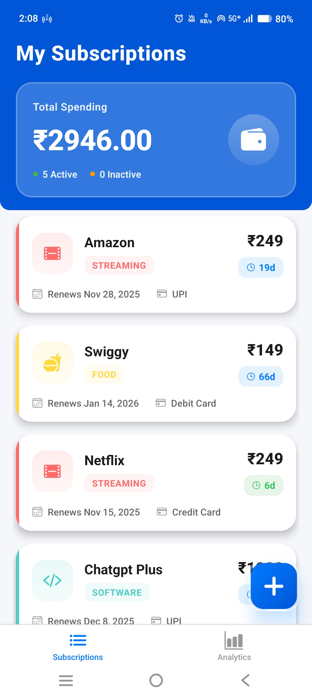
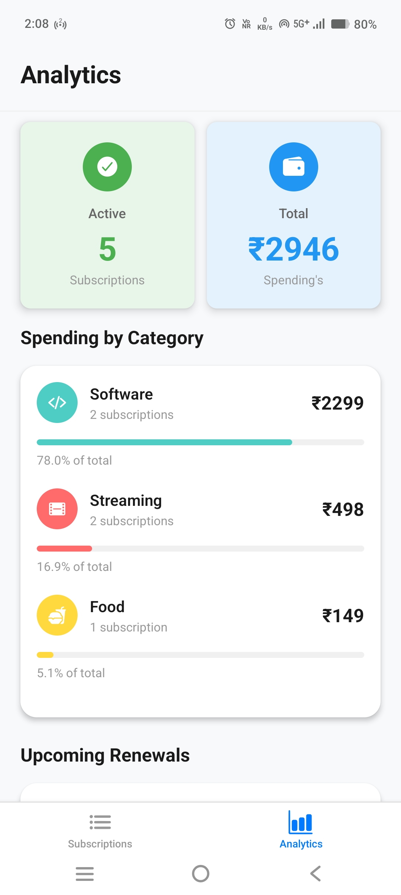
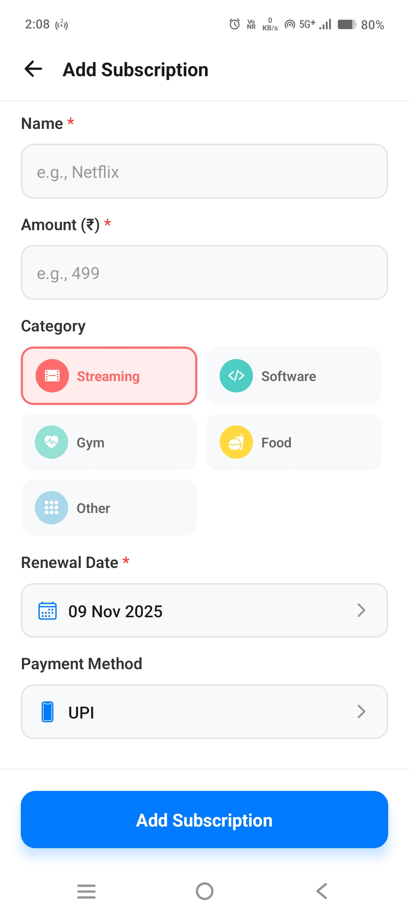
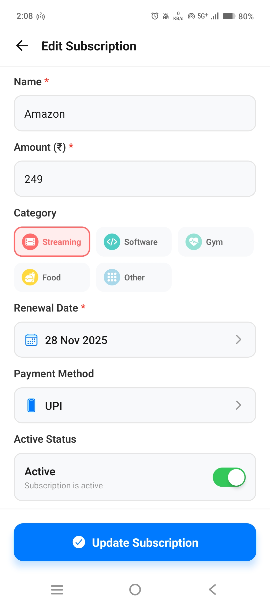
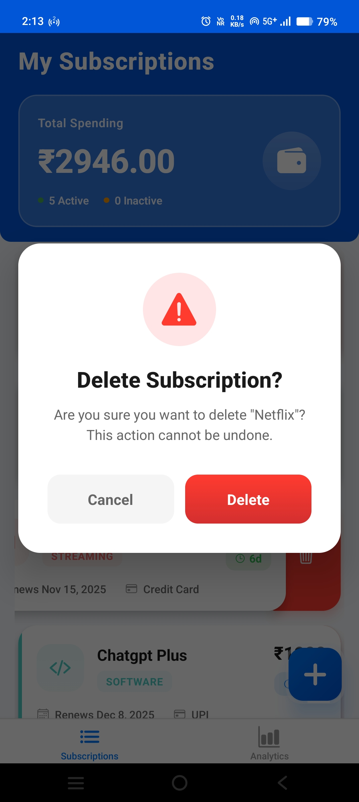
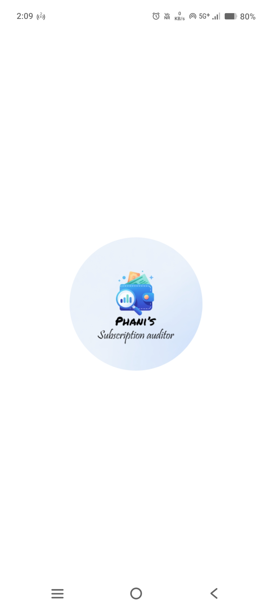

# 📱 Subscription Auditor

[](https://github.com/Phani943/subscription-auditor/releases)
[](https://github.com/Phani943/subscription-auditor/stargazers)
[](LICENSE)

A modern React Native subscription management app built with Expo to help you track and manage all your subscriptions in one place.

[📥 Download APK](https://github.com/Phani943/subscription-auditor/releases/latest/download/subscription-auditor.apk) • [📸 Screenshots](#-screenshots) • [✨ Features](#-features) • [🛠️ Tech Stack](#%EF%B8%8F-tech-stack)

## ✨ Features

- 📊 **Track Multiple Subscriptions** - Add unlimited subscriptions with custom details
- 🏷️ **Category Organization** - Organize by Streaming, Software, Gym, Food, or Other
- 🔔 **Renewal Reminders** - Get notified 24 hours before renewal
- 📈 **Analytics Dashboard** - View spending insights and category breakdowns
- 💳 **Payment Tracking** - Track payment methods (UPI, Debit Card, Credit Card)
- 👆 **Swipe to Delete** - Intuitive gesture controls
- 🎨 **Beautiful UI** - Modern design with gradient effects and smooth animations
- 🔄 **Active/Inactive Toggle** - Pause subscriptions without deleting

## 🛠️ Tech Stack

- **React Native** - Cross-platform mobile development
- **Expo** - Development platform and tools
- **TypeScript** - Type-safe code
- **Zustand** - State management
- **AsyncStorage** - Local data persistence
- **Expo Notifications** - Renewal reminders
- **React Native Gesture Handler** - Swipe gestures
- **Expo Linear Gradient** - Beautiful UI effects

## 🚀 Getting Started

### Prerequisites

- Node.js (v16 or higher)
- npm or yarn
- Expo CLI

### Installation

1. Clone the repository
```bash
git clone https://github.com/Phani943/subscription-auditor.git
cd subscription-auditor
```

2. Install dependencies
```bash
npm install
```

3. Start the development server
```bash
npx expo start
```

4. Run on your device
   - Scan the QR code with Expo Go app (Android/iOS)
   - Press `a` for Android emulator
   - Press `i` for iOS simulator

## 📱 Screenshots

<div align="center">

### Main Screens
<table>
  <tr>
    <td align="center">
      
      <br />
      <b>Home Screen</b>
    </td>
    <td align="center">
      
      <br />
      <b>Analytics</b>
    </td>
    <td align="center">
      
      <br />
      <b>Add Subscription</b>
    </td>
  </tr>
</table>

### Additional Features
<table>
  <tr>
    <td align="center">
      
      <br />
      <b>Edit Subscription</b>
    </td>
    <td align="center">
      
      <br />
      <b>Delete Confirmation</b>
    </td>
    <td align="center">
      
      <br />
      <b>Splash Screen</b>
    </td>
  </tr>
</table>

</div>

## 🏗️ Project Structure
```
subscription-auditor/
├── app/
│   ├── (tabs)/
│   │   ├── index.tsx          # Home screen with subscriptions list
│   │   ├── explore.tsx        # Analytics screen
│   │   └── _layout.tsx        # Tab navigation
│   ├── add-subscription.tsx   # Add new subscription
│   ├── edit-subscription.tsx  # Edit existing subscription
│   └── _layout.tsx            # Root layout
├── src/
│   ├── services/
│   │   └── notificationService.ts
│   ├── store/
│   │   └── subscriptionStore.ts
│   └── types/
│       └── index.ts
├── assets/
└── package.json
```

## 📦 Build APK
```bash
# Generate Android APK
eas build --platform android --profile preview

# Or use local build
npx expo run:android --variant release
```

## 📥 Download

**[Download Latest APK (v1.0.0)](https://github.com/Phani943/subscription-auditor/releases/latest/download/subscription-auditor.apk)** • 31 MB

Compatible with Android 7.0+ • Works on 95% of modern phones

### Installation
1. Download the APK
2. Enable "Unknown Sources" in Settings
3. Install and enjoy! 🎉

---

## 🤝 Contributing

Contributions are welcome! Feel free to open issues or submit pull requests.

## 📄 License

This project is licensed under the MIT License.

## 👨‍💻 Author

**Phani**
- GitHub: [@Phani943](https://github.com/Phani943)

## 🙏 Acknowledgments

- Built with [Expo](https://expo.dev/)
- Icons by [Ionicons](https://ionic.io/ionicons)

---

⭐ Star this repository if you find it helpful!
